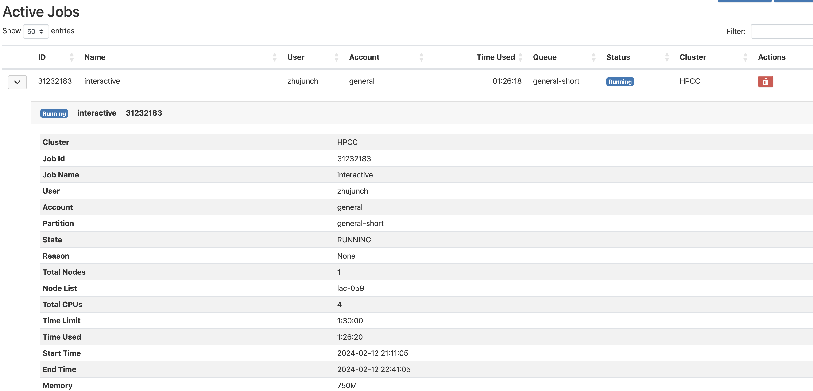

### Part 1
- Exercise 2.18  
Based on the first touch policy, which states that, the first thread to touch the area in effect causes the data to be allocated on the memory of its socket. In the first serial loop, array_a is initialized on a single thread, and then running calculations to reassign values for array_a in parallel, where different sockets are trying to access array_a. Access to array_a would be slower due to the memory being non-local, it lead to performance degradation which defeats the purpose of parallelism.

- Exercise 2.19  
Iteration for first thread: 0, t 2t.  
Iteration for second thread: 1, t+1 2t+1.  
False sharing happens when threads update consecutive locations of an array.  Updating adjacent elements by different threads will lead to the cache line bouncing back and forth between the CPU cores, leading to bad performance. Clearly `a[0],a[1]; a[t],a[t+1]; a[2t],a[2t+1];` are located to each other pairly in the memory, which can be marked as bad performance.  
Perfect chunksize should be large enough that the cashlines do not share cache lines. It would be (cashline size) / (element size), for example, cashline size: 64 bytes and element size: 8 bytes, perfect chuncksize should be 8 (64/8).

- Exercise 2.21  
    ```
    int leftproc, rightproc;
    double bfromleft, bfromright;

    MPI_Comm_rank(MPI_COMM_WORLD,&myTaskID);
    MPI_Comm_size(MPI_COMM_WORLD,&nTasks);

    if (myTaskID==0) leftproc = MPI_PROC_NULL;
        else leftproc = myTaskID-1;
    if (myTaskID==nTasks-1) rightproc = MPI_PROC_NULL;
        else rightproc = myTaskID+1;

    if (myTaskID != 0) {
        MPI_Sendrecv( &b[0], &bfromright, leftproc);
    }

    if (myTaskID != nTasks - 1) {
        MPI_Sendrecv( &b[LocalProblemSize-1], &bfromleft,  rightproc );
    }

    for (i = 0; i < LocalProblemSize; i++) {
        double bleft, bright;

        if (i == 0 && myTaskID == 0) {
            bleft = NULL;
        } else if (i == 0) {
            bleft = bfromleft;
        } else {
            bleft = b[i-1];
        }

        if (i == LocalProblemSize - 1 && myTaskID == nTasks - 1) {
            bright = NULL; 
        } else if (i == LocalProblemSize - 1) {
            bright = bfromright;
        } else {
            bright = b[i+1];
        }

        if (myTaskID == 0 && i == 0) {
            /// first element
            a[i] = (b[i] + bright) / 2.0;
        } else if (myTaskID == nTasks - 1 && i == LocalProblemSize - 1) {
            /// last element
            a[i] = (b[i] + bleft) / 2.0;
        } else {
            a[i] = (b[i] + bleft + bright) / 3.0;
        }
    }
    ```

- Exercise 2.22  
    ```
    int N; // Number of processors
    int x[N]; // The x elements held by each processor
    int y[N]; // The y elements held by each processor

    for (int i = 0; i < N; i++) {
        // receive
        if (i > 0) {
            // buffer: The buffer in which receive the data.
            MPI_Irecv(buffer=y[i-1], sender=i-1, &recv_request);
        }
        if (i == 0) {
            MPI_Irecv(buffer=y[0], sender=N-1, &recv_request);
        }
        // send
        if (i < N - 1) {
            MPI_Isend(buffer=x[i], sender=i+1, &send_request);
        } else {
        MPI_Isend(buffer=x[n-1], sender=0, &send_request);
        }
    }
    ```
    non-blocking allows for overlapping communication with computation, thus reducing the overall execution time of parallel programs. Moreover, it is not necessary to use MPI_Wait to pause program execution until each send or receive operation has finished.  

- Exercise 2.23  
As mentioned in the discussion point above, one message is being sent instead of one, which means lesser bandwidth is required as there are lesser data waiting to be sent. There is also lower latency as the time taken to initiate and complete sending one message is lesser than four.

- Exercise 2.27  
If computation takes no time at all, the program's execution time is entirely bound by communication time. In this case, overlapping provides no benefit.
If communication takes no time, the execution time is bound by the computation time. Here, overlapping provides no benefit. General case (both computation and communication take time): 
If a computer can do its calculations while it's waiting for data to arrive from another computer. We basically saved half of the total time.

### Part 2


### Part 3
- Hello World  
Code: task3_hello.cpp   
Executable: task3_hello   
Output: task3_hello.output  

- 2.3     
Code: task3_question2.3.cpp   
Executable: question2.3  
Output: task3_question2.3.output  

- 2.4    
Code: task3_question2.4.cpp   
Executable: question2.4  
Output: task3_question2.4_process_0.txt     
        task3_question2.4_process_1.txt    
        task3_question2.4_process_2.txt    
        task3_question2.4_process_3.txt

- 2.5    
Code: task3_question2.5.cpp   
Executable: question2.5  
Output: task3_question2.5.output  


### Part 4
- Q1  
ser_pi_calc_p2.cpp

- Q2   


- Q3  


- Q4     
ser_pi_calc_p4.cpp 

- Q5  


- Q6   


- Q7   
(I have results on the same core but I need to check how to request different cores still --Erika)