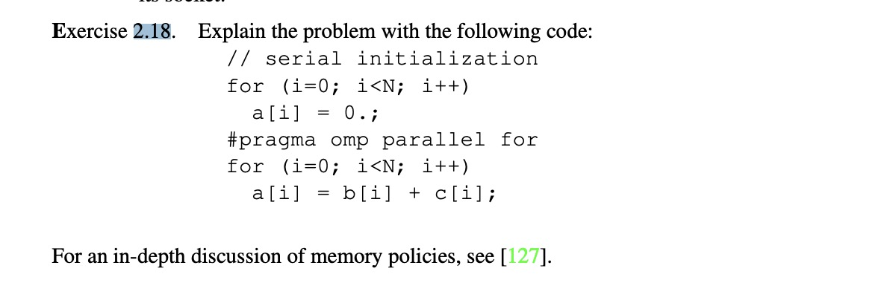
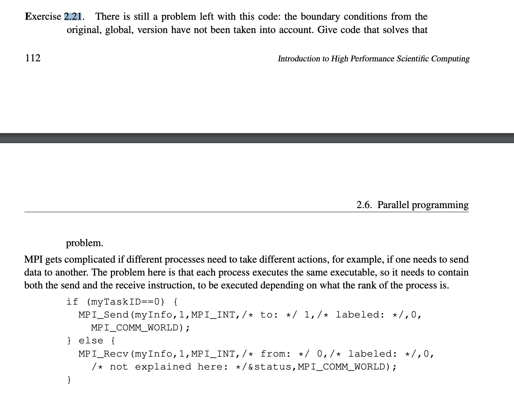

## Part one Warm-up


- question 1  
Based on the first touch policy, which states that, the first thread to touch the area in effect causes the data to be allocated on the memory of its socket. In the first serial loop, a is initialized on a single thread, and then running calculations to reassign values for a in parallel, where different sockets are trying to access a. Access to a would be slower due to the memory being non-local, it lead to performance degradation which defeats the purpose of parallelism.


- question 2



- question 3
```
// Assuming other MPI setup code has already been done, including the elegant exception handling for leftproc and rightproc

for (i = 0; i < LocalProblemSize; i++) {
    double bleft, bright;

    if (i == 0 && myTaskID == 0) {
        bleft = NULL;
    } else if (i == 0) {
        bleft = bfromleft;
    } else {
        bleft = b[i-1];
    }

    if (i == LocalProblemSize - 1 && myTaskID == nTasks - 1) {
        bright = NULL; 
    } else if (i == LocalProblemSize - 1) {
        bright = bfromright;
    } else {
        bright = b[i+1];
    }

    if (myTaskID == 0 && i == 0) {
        /// first element
        a[i] = (b[i] + bright) / 2.0;
    } else if (myTaskID == nTasks - 1 && i == LocalProblemSize - 1) {
        /// last element
        a[i] = (b[i] + bleft) / 2.0;
    } else {
        a[i] = (b[i] + bleft + bright) / 3.0;
    }
}

```


- question 4


- question 5


- question 6
